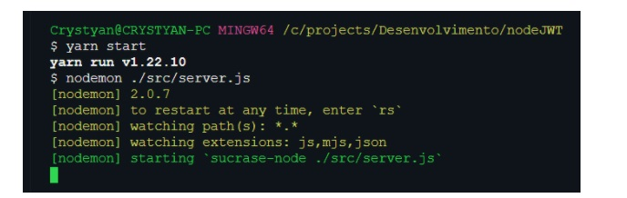

# serverNodeApp

## Sumário
* [Introducao](#introducao)
* [Configuracao e Conhecimentos necessarios](#configuracao-e-conhecimentos-necessarios)
* [Iniciando o Projeto](#iniciando-o-projeto)
* [Criando o Servidor](#criando-o-servidor)

## Introducao 
Nesse projeto pretendo demonstrar de forma simples a criação de uma API utilizando o módulo express e alguns outros módulos que simplificam  e acrescentam bastante na criação de web servers utilizando a plataforma Node JS. 
	
## Configuracao e Conhecimentos necessarios
Para execurtarmos esse projeto será necessário: 
* Node JS versão 14 ou superior  [Node - download](https://nodejs.org/en/download/) 
* Editor de código (Eu estou utilizando o Vs Code) [VSCode - download](https://code.visualstudio.com/download)
* Enteder Lógica de Programação
* Já entender um pouco de Javascript e o padrão [ECMA Script 6 ](https://www.w3schools.com/js/js_es6.asp)

	
## Iniciando o projeto
Criamos uma pasta onde armazenaremos nossa estrutura de códigos, estou utilizando um sistema Windows 10. Portanto, pode ser que isso varie de acordo com o sistema que esteja utilizando. 


Ou seja, criei a pasta **/nodeJWT** no caminho

C:\projects\Desenvolvimento\nodeJWT

Vamos abrir o nosso Editor de código e entrar em nossa pasta utilizando o comando abaixo: 


Quando estiver dentro da pasta seu editar terá a seguinte saída:


Uma vez aberto a pasta do projeto, instalaremos o gerenciador de pacote [Yarn](https://yarnpkg.com/), conforme o comando abaixo:

```
$ yarn  install --global yarn
```

Verificaremos se a instalaçao ocorreu usando o comando: 

```
$ yarn  -v
saída esperada > 1.22.10 
```

## Iniciando
Agora vamos iniciar o nosso projeto utilizando o comando: 

```
$ yarn  init -y
```
utilizamos o **-y** para que ele autocomplete alguns campos 

Vamos também aproveitar para instalar mais algumas dependências

* **nodemon**  > _responsável por reiniciar o nosso servidor toda vez que modificarmos o nosso código js_
        ```
        $ yarn  add nodemon -D
        ```

* **sucrase**  > _responsável por modernizar nossa forma de importar os módulos dentro do node, substituindo o **require** já muito conhecido do node pelo método **import**_
        ```
        $ yarn  add sucrace -D
        ```

* **express** > _responsável por nos possibilitar a criação de APIs de forma rápida e dinâmica_

     ```
        $ yarn  add express
    ```

    Apos a instalação dessas dependências nosso package.json ficará dessa maneira:

    
    
    Note que já configurei o meu campo **Scripts**
    ```
  "scripts": {
    "start": "nodemon ./src/server.js"
  },
    ```

    Ele será necessário para iniciarmos o nosso servidor. 

    Portanto criaremos a pasta **/src** onde ficará o nosso arquivo server.js 

    
    
    Em seguida, na raiz do nosso projeto criaremos o **nodemon.json** que será utilizado para [transpilar](https://natanaelfonseca.com.br/2017/02/08/transpilar-codigo-para-javascript/#:~:text=Transpilar%20significa%20converter%20um%20c%C3%B3digo,c%C3%B3digo%20equivalente%20em%20outra%20linguagem) o nosso código através da nossa lib sucrase. 

    

    Dentro do nodemon.json vamos por código abaixo

    ```
  {
    "execMap": {
      "js": "sucrase-node"
    }
  }
    ```
Feito esses passos, vamos criar o nosso servidor no arquivo server.js 

## Criando o Servidor 
Conforme apontamos anteriormente, dentro da pasta /src vamos criar o nosso arquivo server.js que conterá o código para a criação do nosso servidor  
<br />

Uma vez dentro do nosso server.js iniciamos importando o express 
```
 import express from "express";
 ```
para saber mais(http://expressjs.com/en/starter/installing.html)

Ele é quem nos possibilitará a rápida criação do servidor e das estruturas básicas para isso. 

Logo em seguida importamos também o módulo Router do express, responsável pela criação e manipulação das nossas rotas, disponibilizando na instância de seu objeto os métodos https responsáveis pelas requisições que iremos realizar. 

```
import { Router } from "express";
 ```
Criaremos o objeto server e o objeto routes 


Onde o server é o nosso servidor e routes é o manipulador de rotas

Vamos declarar alguns middlewares importantes para iniciarmos o nosso servidor

para saber mais sobre middlewares (http://expressjs.com/en/guide/using-middleware.html)


Basicamente, a função dos middlewares é interceptar nossas requisições e realizar algumas verificações, de acordo com o que configurarmos ou for importante para nós. 

No caso o primeiro é utilizado para realizar um parse das nossas requisições json e o segundo para verificar trabalha para realizar o parse dos parâmetros passados pela url, onde o extendend false informa que não aceitamos object nested. 

para saber mais: 

https://hackernoon.com/accessing-nested-objects-in-javascript-f02f1bd6387f
https://pt.stackoverflow.com/questions/130758/ajuda-com-funcao-urlencode


Agora criaremos nossa primeira rota /clientes que apenas nos retornará um json com uma mensagem


Ao fim do documento vamos faze nosso server utilizar nossa rota criada e fazer ele executar nosso servidor na porta 3000 


Finalizando o nosso server.js, podemos agora testar nossa aplicação. 

Vamos utilizar o seguinte comando 

```
yarn start 
```

Caso tudo esteja correto essa será a saída do seu terminal



Abra o seu navegador e digite a seguinte rota 

[localhost:3000/clientes](http://localhost:3000/clientes)

Se tudo estiver ok essa será a nossa saída


Show! Nosso servidor está funcionando conforme esperado. 

Aqui chegamos ao fim dessa primeira parte. Em breve pretendo trazer mais atualizações melhorias para o nosso código. 

Qualquer dúvida é só entrar em contato que estarei disposto a ajudá-lo. @octocat :+1: :smiley:


### ... Teremos mais conteúdo
